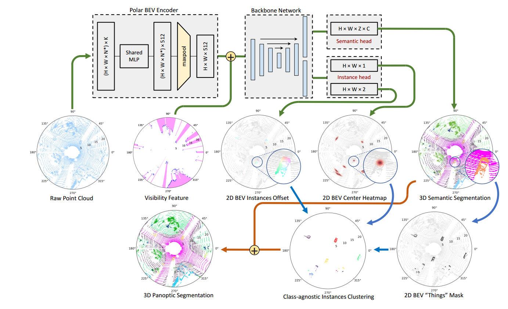
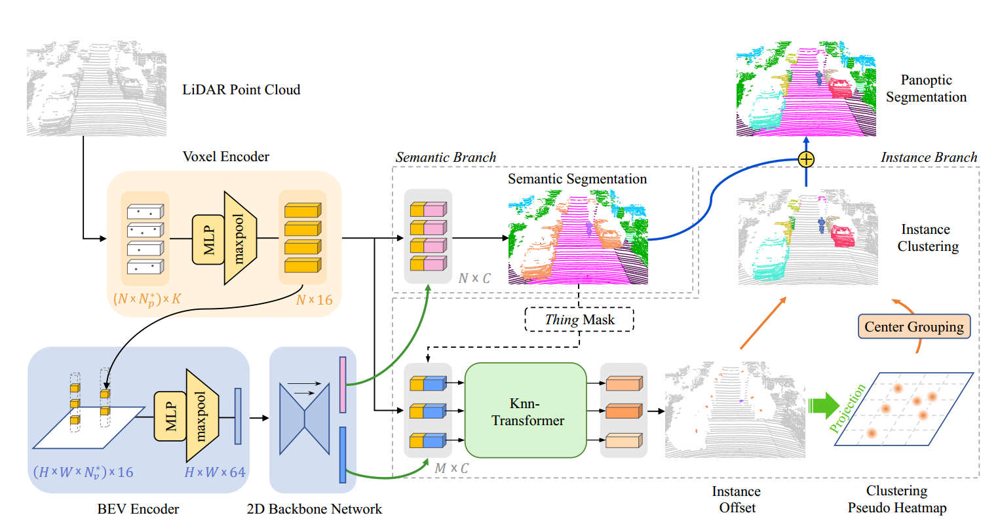

- [Panoptic-polarnet](#panoptic-polarnet)
  - [网络流程](#网络流程)
  - [总结](#总结)
- [Panoptic-PHNet](#panoptic-phnet)
  - [网络流程](#网络流程-1)
  - [总结](#总结-1)
  - [PHNet与Polarnet的区别](#phnet与polarnet的区别)

# Panoptic-polarnet

**_论文链接_** _[Panoptic-polarnet.pdf](./1/panoptic-polarnet.pdf)_

## 网络流程
1. **语义分支：** 首先网络对每个 BEV 网格（像素）给出类别概率（包括“thing”和“stuff”）。
2. **实例分支 – 中心热图：** 网络同时预测一个“中心热图”，标出所有实例的中心大概位置，通过 NMS 抽取出一批候选中心{c~𝑖~}。
3. **实例分支 – 偏移向量：** 对每个“thing”类前景网格点𝑝，网络还预测一个偏移向量Δ𝑝 ，它指向该点所属实例的质心。
4. **投票聚类：** 每个前景点按 $\hat{c}$(𝑝)=𝑝+Δ𝑝 计算自己的“投票后中心”，然后把它归到距离最近的候选中心c~𝑖~那一簇里。
5. **实例类别决定：** 对于聚成的一簇点（一个实例），再看这些点在语义分支上的类别概率，取多数票作为该实例的最终类别。

## 总结
* 语义头是为了每个点得到类别，但不区分实例。
* 实例头为了每个点得偏移向量和中心热图，确定“投票”到哪个实例中心。
* 聚类是为了拿到每个实例的簇，再看这些点的语义预测，多数投票决定该实例到底是哪一类。

# Panoptic-PHNet

**_论文链接_** _[Panoptic-PHNet.pdf](./1/Panoptic-PHNet2205.07002v1.pdf)_

## 网络流程
**1. 点云预处理与体素化**
* 将原始稀疏LiDAR点云P={(x,y,z,r)}按极坐标（或柱状）划分到固定尺寸的体素格，得到形状为(𝐻~𝑣~,𝑊~𝑣~,D~𝑣~)的体素栅格。
* 每个体素内部使用简化 PointNet（共享 MLP + max‑pool）提取𝐶~𝑣~维局部特征，生成体素特征图F~𝑣~。

**2. BEV 特征映射与骨干网络**
* 将体素特征F~𝑣~沿高度轴投影到BEV平面，得到𝐻×𝑊×𝐶~𝑣~的BEV特征图。
* 输入到 2D U‑Net 编码器–解码器骨干，产生多尺度上下文特征。
* 将解码器中间特征重映射回体素层，与原始体素特征拼接，进一步融合细粒度与全局上下文。

**3. 多任务预测头**
* **语义头：**
  * 对骨干BEV特征输出每个BEV网格的𝑉类别。
  * Softmax → 每点类别概率 → 生成语义分割预测

* **实例头：**
  * 对同一特征图回归每点到其所属实例中心的偏移向量Δ𝑝(KNN–Transformer)
  * 不额外学习中心热图，而是后续通过 Clustering Pseudo Heatmap (CPH) 生成伪热图。

**4. CPH 伪热图 & Center Grouping**
* **偏移平移：** 将每个“thing”点𝑝按预测偏移$\hat{Δ𝑝}$(𝑝)平移到$\hat{c}$(𝑝)=𝑝+$\hat{Δ𝑝}$(𝑝)
* **伪热图生成：** 将所有平移后点投影到 BEV 网格，以每格点数作为热度，形成“伪中心热图”。
* **峰值提取：** 在伪热图上做 2D 窗口式最大池化，提取所有局部峰值位置作为候选中心集合 {𝑐~𝑖~′}。
* **冗余中心合并：** 按照类别依窗口内点数做合并，并对距离小于类别特定半径的中心对进行合并，得到最终中心集合 {𝑐~𝑖~}。

**5. 实例分配与输出映射**
* **前景筛选：** 用语义预测筛出所有“thing”类点集合。
* **最近中心分配：** 对每个前景点𝑝,计算其投票后中心$\hat{c}$(𝑝)与所有$c$~𝑖~的距离，分配给最近中心，得到实例ID。
* **实例类别确定：** 对每个实例簇内点的语义概率做多数投票，决定该实例的类别标签。
* **映射回点云：** 将BEV网格上的类别和实例ID按原始投影索引赋回到每个3D点，输出完整的Panoptic分割结果。

## 总结

* **输入：** 稀疏 LiDAR 点云 → Voxel Encoder → BEV 编码 + 2D U‑Net → 得到：
  * 语义 logits → Softmax → 每点类别预测；
  * 偏移向量场 → 将“thing”点平移至$\hat{c}$=𝑝+$\hat{Δ𝑝}$
* **聚类：** 投影平移后点 → 生成 CPH → max‑pool 提取中心 → Center Grouping → 最终中心集合{$c_i$}
* **实例分配:** 每点按最小距离归属最近中心 → 得到实例 ID；
* **输出：** 结合语义预测与实例 ID，映射至原始点云，产出 Panoptic 结果。

## PHNet与Polarnet的区别

* **中心热图的生成方式**
  * **PolarNet：** 在实例头里额外学习一个“中心热图”分支，网络需同时回归中心热图和偏移向量。
  * **PHNet：** 取消了专门的热图分支，而是先用网络预测的偏移向量把各点平移到“伪”中心聚簇区域，直接基于聚簇后点密度生成“伪热图”（Clustering Pseudo Heatmap），再做简单的窗口最大池化提取峰值，完全不需额外学习热图
 
* **偏移向量的回归网络** 
  * **PolarNet：** 典型地用轻量 MLP/卷积层对每点做偏移回归。
  * **PHNet：** 引入 KNN‑Transformer 模块，以每点及其近邻构建局部图，在图上做自注意力计算，显著提升偏移回归精度，从而让伪热图峰值更集中、实例分割更精确

* **冗余中心的合并策略**

  * **PolarNet：** 仅用 NMS＋Top‑k 提取中心，后续靠投票自然分簇，对过大实例可能产生重复中心。
  * **PHNet：** 在伪热图提峰后，增加 Center Grouping 模块，根据峰值周围点密度和类别特定的合并半径，将过于接近的中心合并，确保每个实例只有一个中心，提升实例完整性

* **骨干与特征融合**
  * **PolarNet：** 典型的单一极坐标BEV‑U‑Net。
  * **PHNet：** 在BEV U‑Net之上，还将中间多尺度BEV特征重映射回体素层，与细粒度PointNet提取的体素特征拼接融合，兼顾全局上下文与局部细节，从而提高语义分割和实例分割效果

* **性能与效率**
  * **PolarNet：** 实时 (~0.08 s/帧)，PQ ≈ 59.1%（SemanticKITTI）。
  * **PHNet：** 依旧满足 10 Hz 实时需求，同时 PQ 提升至 61.5%。

